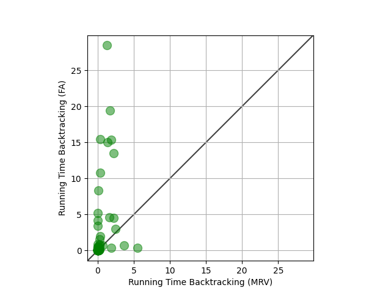

# Sudoku CSP Solver

This project implements a Constraint Satisfaction Problem (CSP) solver for traditional 9×9 Sudoku puzzles using:

- Backtracking Search
- Minimum Remaining Values (MRV) heuristic
- First Available heuristic
- Domain-specific AC3 constraint propagation

## Features

- Solves 9×9 Sudoku puzzles
- Compares MRV and First Available heuristics
- Benchmarked on 95 challenging Sudoku puzzles
- Generates scatter plot performance comparison

## Performance Comparison

The scatter plot below compares MRV and First Available:



Points above the diagonal indicate that First Available took longer than MRV.

## How to Run

```bash
pip install -r requirements.txt
python sudoku_solver.py
